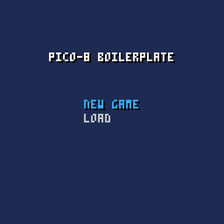

# Pico-8 Boilerplate
A minimal boilerplate for Pico-8 projects with input management, scene handling, nested menus, and save/load functionality.



## Features
- **App Manager** – Central configuration with defaults and save data structure
- **Input Management** – Bind buttons to actions with context stacking
- **Scene Management** – Switch between scenes or stack overlays with `push()` and `pop()`
- **Message Bus** – Event system for decoupled communication
- **Menu System** – Nested menus with dynamic states and actions
- **State Machine** – FSM for managing states within scenes
- **Slot System** – Save and load game data across 3 persistent slots

## Quick Start

### Initialize Your App
```lua
function _init()
  app:init({
    name = "my_game_v1",
    title = "My Game",
    defaults = {
      score = 0,
      level = 1,
      lives = 3
    }
  })

  scene:register('title', title_scene)
  scene:register('game', game_scene)
  scene:register('pause', pause_scene)

  scene:switch('title')
end

function _update()
  input:update()
  scene:update()
end

function _draw()
  cls()
  scene:draw()
end
```

### Create a Scene
```lua
my_scene = {}

function my_scene:init()
  self.data = app:copy_defaults()

  input:bind({
    [input.button.x] = function() self.menu:show() end,
    [input.button.o] = function() scene:push('pause') end
  })
end

function my_scene:update()
  -- game logic
end

function my_scene:draw()
  -- rendering
end

function my_scene:exit()
  -- cleanup (input is auto-reset on scene:switch)
end

-- called when another scene is pushed on top
function my_scene:pause()
  -- pause music, timers, etc
end

-- called when returning from a pushed scene
function my_scene:resume()
  -- resume music, etc
end
```

### Scene Stacking (Overlays)
For pause menus, dialogs, or other overlays that should render on top of the current scene:

```lua
pause_scene = {
  draws_underneath = true,    -- scene below still draws
  updates_underneath = false  -- scene below pauses updating
}

function pause_scene:init()
  input:bind({
    [input.button.x] = function() scene:pop() end
  })
end

function pause_scene:draw()
  -- dim effect, pause text, etc
end
```

Push and pop overlays:
```lua
scene:push('pause')  -- pushes overlay, pauses scene below
scene:pop()          -- removes overlay, resumes scene below
```

### Create Menus
```lua
my_menu = menu:new({
  {label = "start", action = function() scene:switch("game") end},
  {label = "options", sub_menu = menu:new({
    {label = "sound on", action = function() sfx_on = true end},
    {label = "sound off", action = function() sfx_on = false end}
  })},
  {label = "quit", action = function() return true end}  -- return true to close menu
}, x, y, {
  bgcol = 13,        -- background color
  dropcol = 0,       -- shadow color
  bordcol = 6,       -- border color
  show_bg = true,    -- show background
  show_border = true,-- show border
  show_shadow = true,-- show drop shadow
  closeable = true   -- can close with O button
})
```

Dynamic labels and enabled states:
```lua
{label = function() return sfx_on and "sound: on" or "sound: off" end,
 action = function() sfx_on = not sfx_on end},
{label = "continue",
 enabled = function() return slot:exists(1) end,
 action = function() load_game(1) end}
```

Show and hide menus:
```lua
my_menu:show()           -- opens menu, pushes input context
my_menu:hide()           -- closes menu, pops input context
my_menu:close_parents()  -- closes all parent menus (for nested menus)
```

### Bind Input
```lua
input:bind({
  [input.button.x] = function() attack() end,           -- triggers on press
  [input.button.o] = function() jump() end,
  [input.button.hold.left] = function() player.x -= 1 end,  -- triggers every frame while held
  [input.button.hold.right] = function() player.x += 1 end
})
```

Available buttons: `left`, `right`, `up`, `down`, `o`, `x`

Use `input.button.hold.*` for continuous input (movement). Regular buttons trigger once on press.

Input context stacking:
```lua
input:push()   -- save current bindings, start fresh
input:bind({...})  -- bind new controls
input:pop()    -- restore previous bindings
input:clr()    -- clear current bindings
input:reset()  -- clear everything including stack
```

### Use States Within Scenes
For complex scenes with multiple states (playing, paused, game over):

```lua
function my_scene:init()
  self.fsm = state:new({
    playing = {
      bindings = {
        [input.button.x] = function() fire() end
      },
      init = function(s, data) end,
      update = function(s, data) end,
      draw = function(s, data) end,
      exit = function(s, data) end
    },
    game_over = {
      init = function(s, data) end,
      update = function(s, data) end,
      draw = function(s, data) end
    }
  }, 'playing')
end

function my_scene:update()
  self.fsm:update()
end

function my_scene:draw()
  self.fsm:draw()
end
```

Switch states:
```lua
self.fsm:switch('game_over')
```

States with `bindings` tables automatically push/pop input contexts on switch.

### Save & Load System
The slot system is initialized automatically via `app:init()`. The keys from your `defaults` table define what can be saved.

```lua
-- save to slot 1
slot:save(1, {
  score = player.score,
  level = current_level,
  lives = player.lives
})

-- load from slot 1
local data = slot:load(1)
if data then
  player.score = data.score
  current_level = data.level
  player.lives = data.lives
end

-- check if slot has data
if slot:exists(1) then
  print("saved at: " .. slot:timestamp(1))
end

-- delete a slot
slot:delete(1)
```

**Slot Limitations:**
- 3 slots available (configurable via `slot.slots`)
- 18 values per slot maximum
- Only numbers supported (integers, decimals, or 0/1 for booleans)

### Message Bus
Send and receive events across your game:

```lua
-- subscribe (returns unsubscribe function)
local unsub = message_bus:subscribe('player_died', function(data)
  lives -= 1
  print("died from: " .. data.reason)
end)

-- emit event
message_bus:emit('player_died', {reason = 'fell'})

-- unsubscribe
unsub()
-- or
message_bus:unsubscribe('player_died', callback)

-- clear subscribers
message_bus:clr('player_died')  -- clear specific event
message_bus:clr()               -- clear all
```

Built-in events:
- `scene_changed` – `{to = name}`
- `scene_pushed` – `{name = name}`
- `scene_popped` – `{}`
- `state_changed` – `{mgr = state, from = prev, to = name}`

## File Structure
```
├── bp.p8                    # main cartridge
└── src/
    ├── main.lua             # entry point
    ├── system/
    │   ├── app.lua          # app configuration
    │   ├── input.lua        # input management
    │   ├── menu.lua         # menu system
    │   ├── message_bus.lua  # event system
    │   ├── scene.lua        # scene management
    │   ├── slot.lua         # save/load system
    │   └── state.lua        # state machine
    └── scenes/
        ├── title_scene.lua
        ├── game_scene.lua
        └── pause_scene.lua
```
